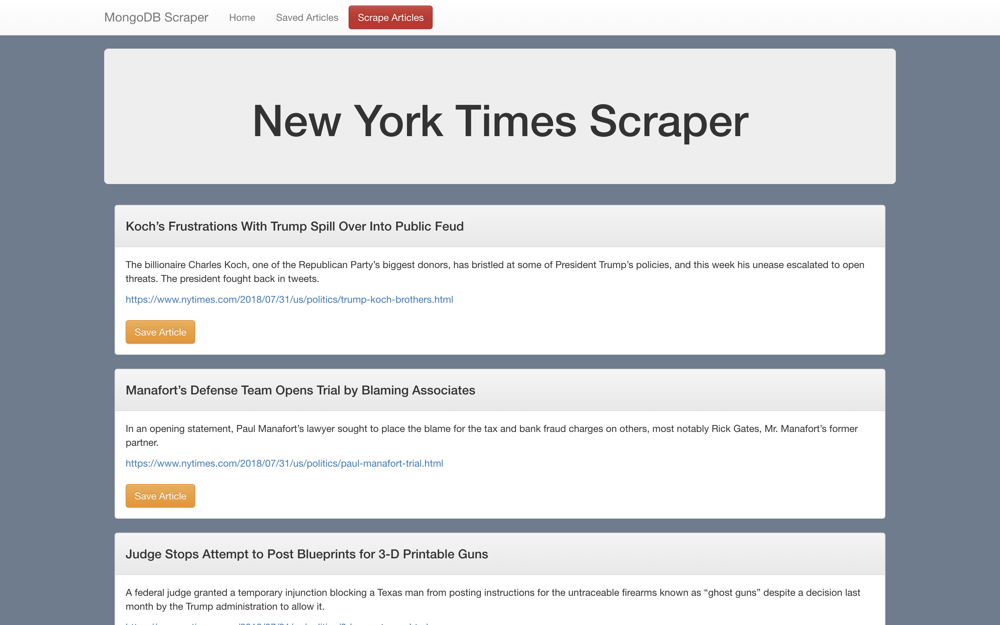
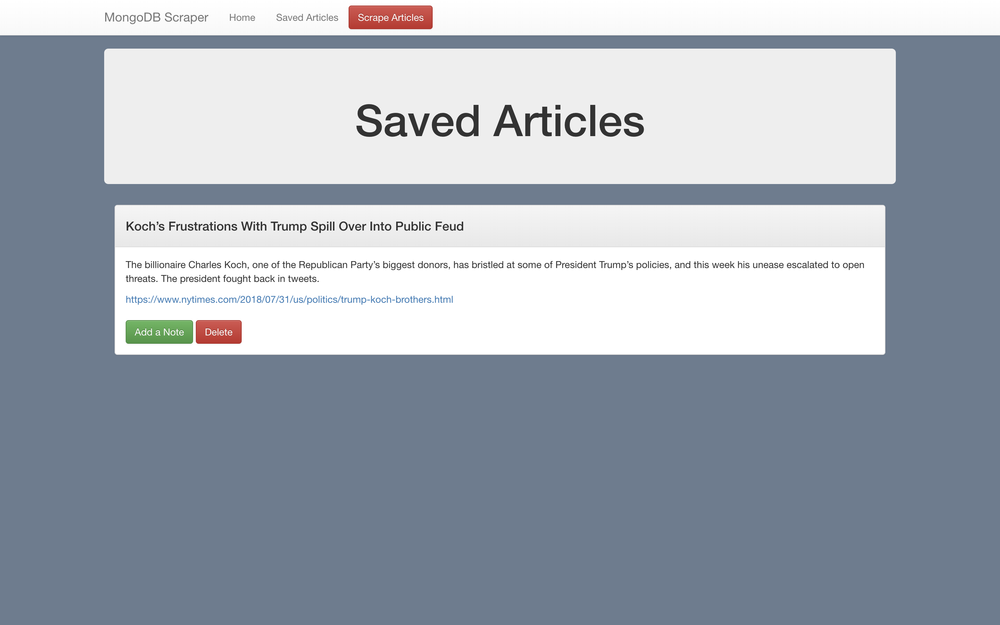
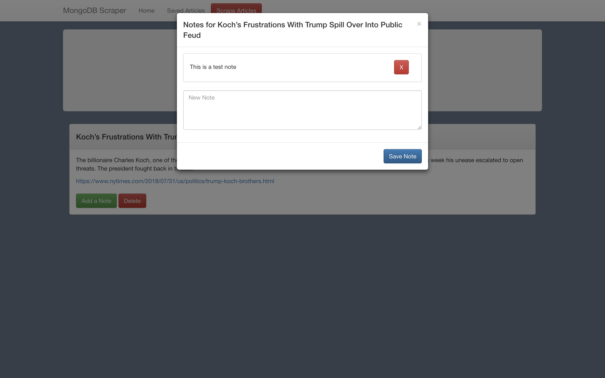

# MongoDB-NYT-Scraper

## Heroku Link
https://powerful-fjord-39226.herokuapp.com/

## Functionality
On the backend, the app uses `express` to serve routes and `mongoose` to interact with a `MongoDB` database.

On the frontend, the app uses `handlebars` for templating each article and `materialize` as a styling framework. The app also uses `jQuery` and `AJAX` to help with making post requests.

And for webscraping, the app uses the `request` and `cheerio` node packages. All webscrapping code can be found in the `controllers.js` file.

Home

Note

